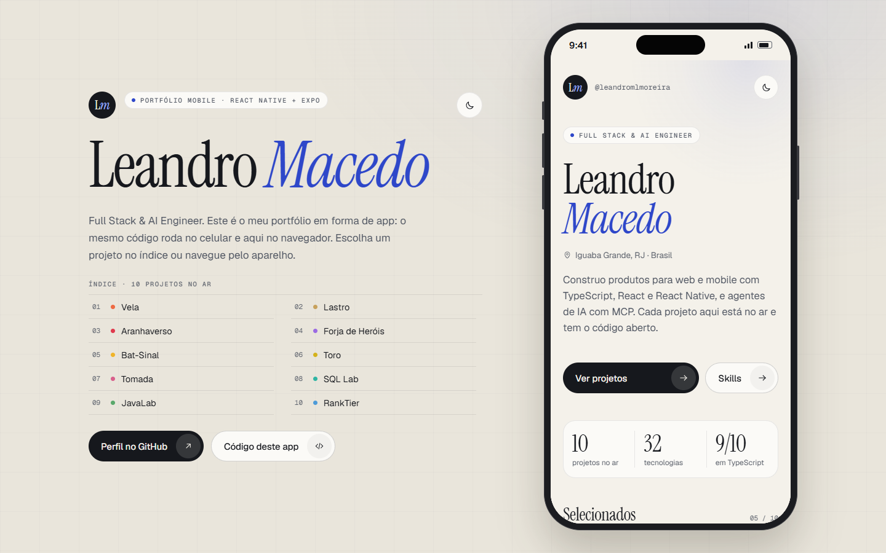
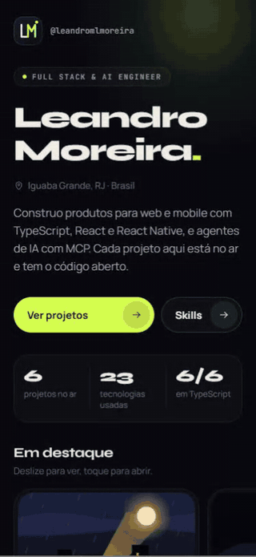
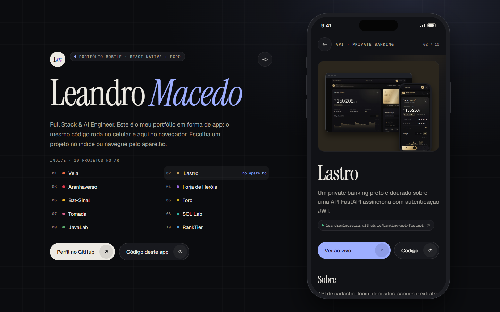
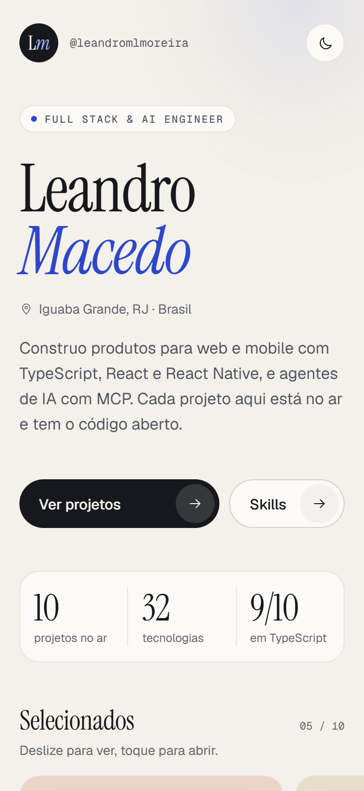
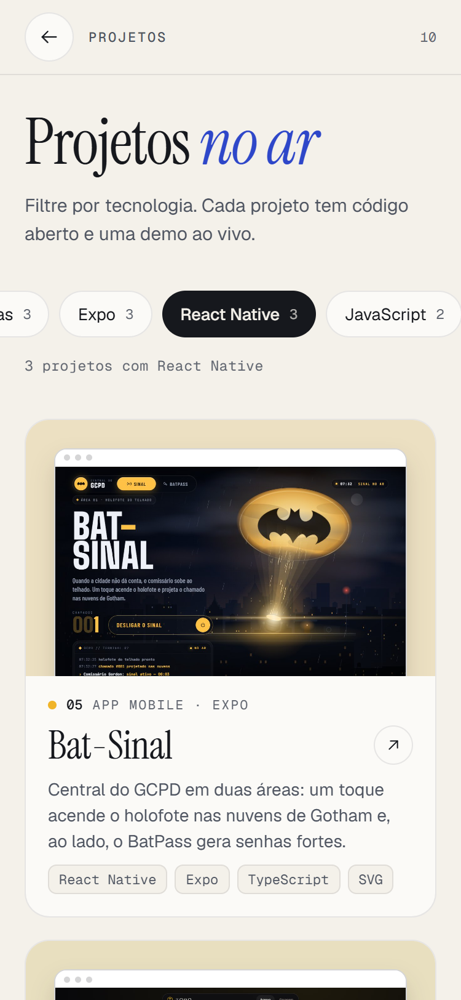
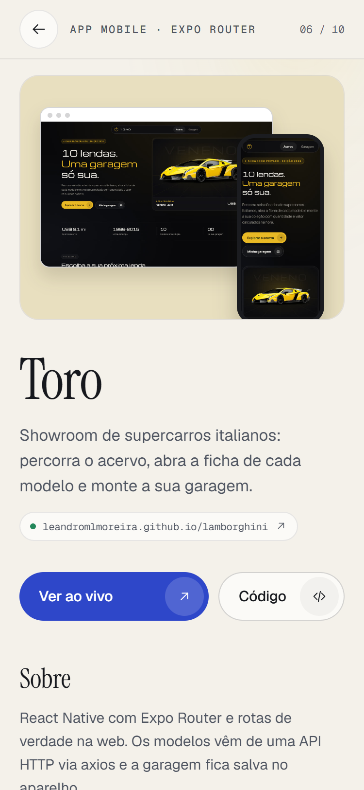
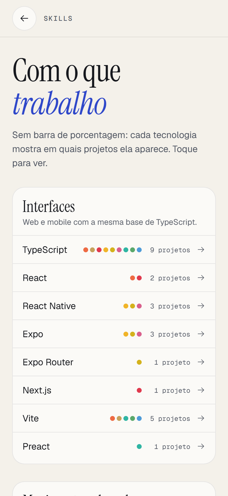
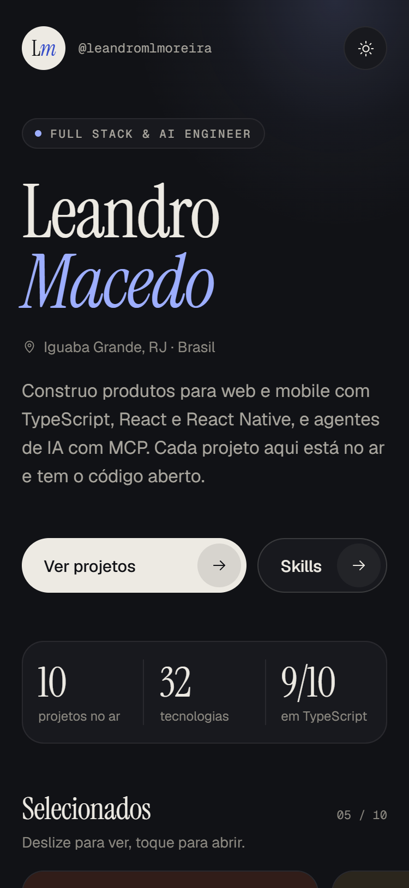

# Leandro Macedo · Portfólio

Meu portfólio em forma de app, feito em React Native + Expo: os 10 projetos que estão no ar, com print real de cada um, filtro por tecnologia, detalhes, links e as ferramentas com que trabalho, no celular e na web.

**[Ver ao vivo →](https://leandromlmoreira.github.io/portfolio/)**

<p>
  
  
</p>

<p>
  
  
</p>

<p>
  
  
  
  
</p>

## Funcionalidades

- **Início.** Nome, função, localização, números tirados dos próprios dados (projetos no ar, tecnologias usadas, quantos usam TypeScript), carrossel com os projetos selecionados e links para o GitHub e o site.
- **Projetos com filtro por stack.** Os filtros são gerados a partir das tecnologias dos projetos, com a contagem de cada uma. Tocar numa tecnologia de novo volta para "Todos".
- **Capas com prints reais.** Cada cartão mostra o print do projeto numa janela de navegador sobre a cor do projeto; no detalhe, a versão desktop e a do celular aparecem juntas.
- **Detalhe do projeto.** Descrição, destaques, stack, endereço no GitHub Pages e botões "Ver ao vivo" e "Código", que abrem a demo e o repositório com `Linking`. No fim, atalho para o próximo projeto.
- **Skills sem porcentagem inventada.** Cada tecnologia mostra em quantos projetos aparece, com a cor de cada um; tocar leva à lista já filtrada.
- **Tema claro e escuro.** Segue o tema do sistema e pode ser trocado por um botão, no app e no palco do desktop. Textos com contraste AA nos dois temas.
- **Web no desktop.** Em telas largas, o app roda dentro de um aparelho ao lado de uma apresentação com o índice dos projetos; o índice abre o projeto direto no aparelho e marca qual está aberto.
- **Detalhes de produto.** Entrada suave das seções com curva de easing própria, botões que afundam ao toque, capas que sobem no hover, anel de foco só para quem navega pelo teclado e respeito a "reduzir movimento".

## Identidade visual

- **Tipografia:** Instrument Serif nos títulos e números (com o itálico como destaque), Geist no texto e na interface, Geist Mono em metadados técnicos. Todas do Google Fonts via `@expo-google-fonts`.
- **Cores:** papel quente (`#F4F1EA`) com tinta grafite (`#16181D`) e acento cobalto (`#2E47C9`) no tema claro; grafite (`#111216`) com off-white (`#EDEAE3`) e acento pervinca (`#9DAEFF`) no escuro. As cores de cada projeto aparecem só como marcação e fundo das capas.

## Projetos no app

| Projeto | O que é | Demo |
| --- | --- | --- |
| [Vela](https://github.com/leandromlmoreira/banco-digital) | Banco digital fictício: site, internet banking, painel, console e API | [ao vivo](https://leandromlmoreira.github.io/banco-digital/) |
| [Lastro](https://github.com/leandromlmoreira/banking-api-fastapi) | Private banking sobre uma API FastAPI assíncrona com JWT | [ao vivo](https://leandromlmoreira.github.io/banking-api-fastapi/) |
| [Aranhaverso](https://github.com/leandromlmoreira/spiderverse) | Revista em quadrinhos interativa com glitch dimensional | [ao vivo](https://leandromlmoreira.github.io/spiderverse/) |
| [Forja de Heróis](https://github.com/leandromlmoreira/herolevel) | Cartas colecionáveis em pixel art forjadas a partir do nome e do XP | [ao vivo](https://leandromlmoreira.github.io/herolevel/) |
| [Bat-Sinal](https://github.com/leandromlmoreira/bat-sinal) | Central do GCPD em React Native: cena de Gotham em SVG e o gerador de senhas BatPass | [ao vivo](https://leandromlmoreira.github.io/bat-sinal/) · [BatPass](https://leandromlmoreira.github.io/bat-sinal/#batpass) |
| [Toro](https://github.com/leandromlmoreira/lamborghini) | Showroom de supercarros em React Native + Expo Router com API via axios | [ao vivo](https://leandromlmoreira.github.io/lamborghini/) |
| [Tomada](https://github.com/leandromlmoreira/video-capture) | Estúdio de vídeo de bolso com câmera no aparelho e MediaRecorder na web | [ao vivo](https://leandromlmoreira.github.io/video-capture/) |
| [SQL Lab](https://github.com/leandromlmoreira/sql-lab) | Modelagem e SQL com playground que roda os scripts no navegador | [ao vivo](https://leandromlmoreira.github.io/sql-lab/) |
| [JavaLab](https://github.com/leandromlmoreira/javalab) | Apps em Java abertos numa IDE que roda no navegador | [ao vivo](https://leandromlmoreira.github.io/javalab/) |
| [RankTier](https://github.com/leandromlmoreira/ranktier) | RPG pixel art de duelos sobre uma biblioteca de patentes em JavaScript | [ao vivo](https://leandromlmoreira.github.io/ranktier/) |

Os textos de cada projeto ficam em [`src/data/projects.ts`](src/data/projects.ts) e os prints em [`assets/projects/`](assets/projects); perfil e links em [`src/data/profile.ts`](src/data/profile.ts); grupos de skills em [`src/data/skills.ts`](src/data/skills.ts).

## Stack

- [Expo](https://docs.expo.dev/) SDK 57 + React Native 0.86, TypeScript
- React Navigation com Native Stack (`Home`, `Projects`, `Project`, `Skills`)
- [react-native-svg](https://github.com/software-mansion/react-native-svg) para ícones, grade do palco e brilhos de fundo
- API `Animated` com driver nativo no celular
- `expo-font` + `@expo-google-fonts` (Instrument Serif, Geist, Geist Mono)
- Deploy da versão web no GitHub Pages via GitHub Actions

## Como rodar

```bash
git clone https://github.com/leandromlmoreira/portfolio.git
cd portfolio
npm install
npm start
```

Escaneie o QR code com o Expo Go ou abra direto numa plataforma:

```bash
npm run web       # navegador
npm run android   # emulador ou dispositivo Android
npm run ios       # simulador ou dispositivo iOS
```

## Qualidade e deploy

```bash
npm run typecheck   # tsc --noEmit
npm run build       # exporta a versão web estática para dist/
```

A cada push na `main`, o workflow [`deploy-pages.yml`](.github/workflows/deploy-pages.yml) checa os tipos, exporta a web com `baseUrl` `/portfolio` (definido no `app.json`) e publica no GitHub Pages.

## Estrutura

```
src/
├── data/          perfil, projetos e grupos de skills
├── lib/           contagem e filtro por stack, links e modo de entrada
├── navigation/    Native Stack e tipos das rotas
├── screens/       Home, Projects, Project, Skills
├── components/    cartões, capas, chips, botões, palco do desktop
├── hooks/         reduzir movimento, hover e ids únicos para SVG
└── theme/         paletas clara e escura, tema, fontes, espaçamentos e curvas
```

---

<sub>Nasceu do desafio "Criando seu App de Portfólio" da trilha Formação React Native Developer da DIO.</sub>
